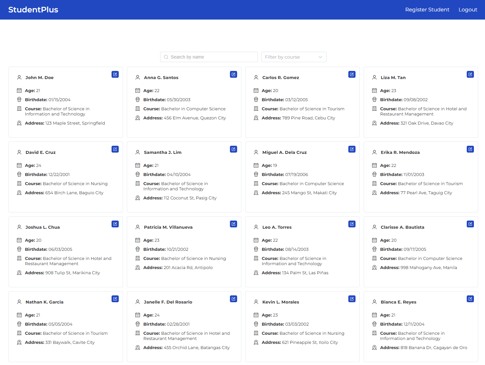
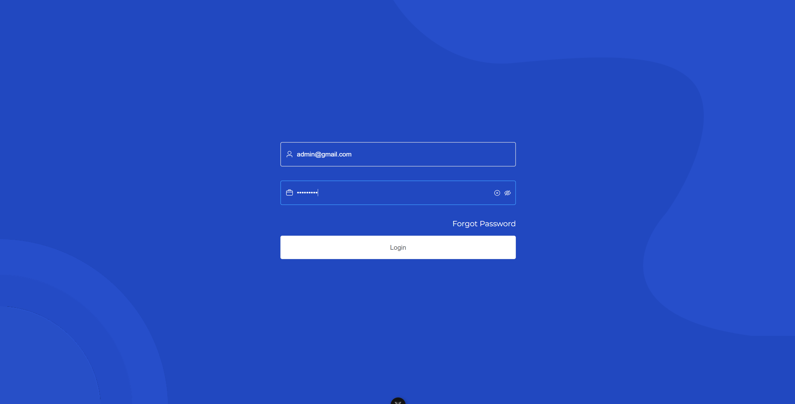
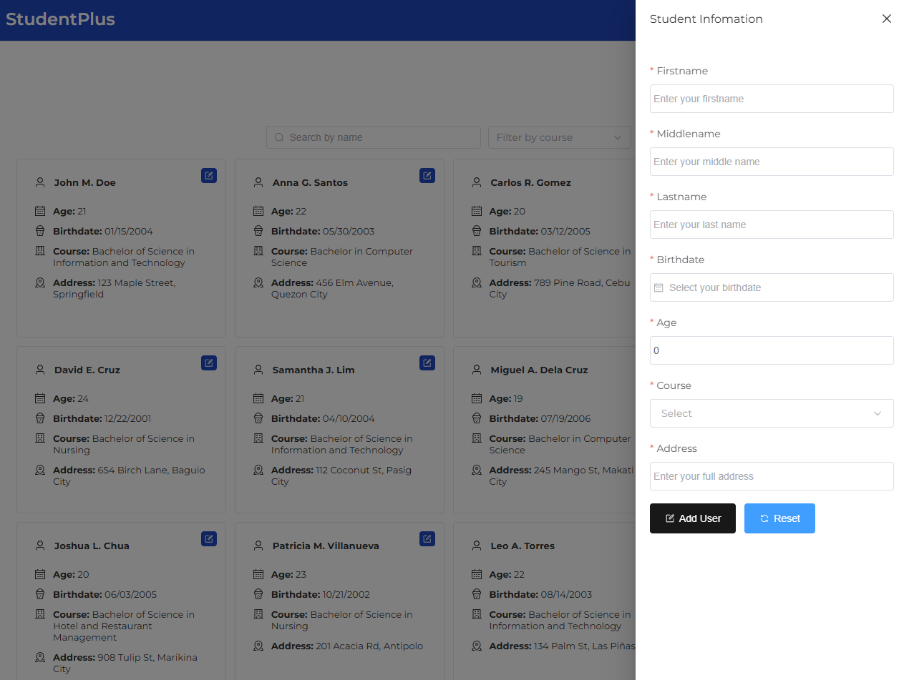
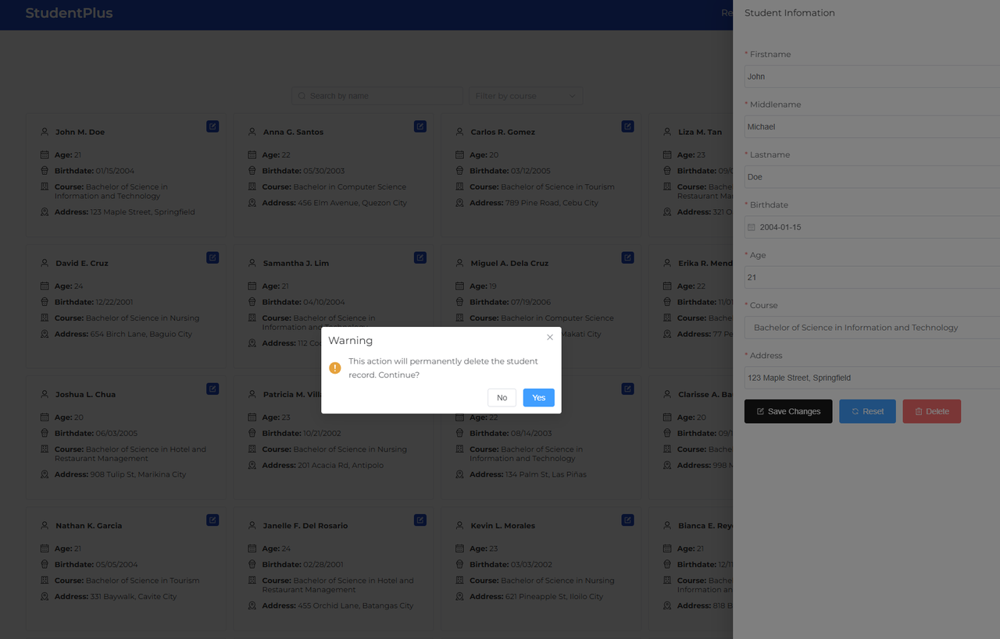
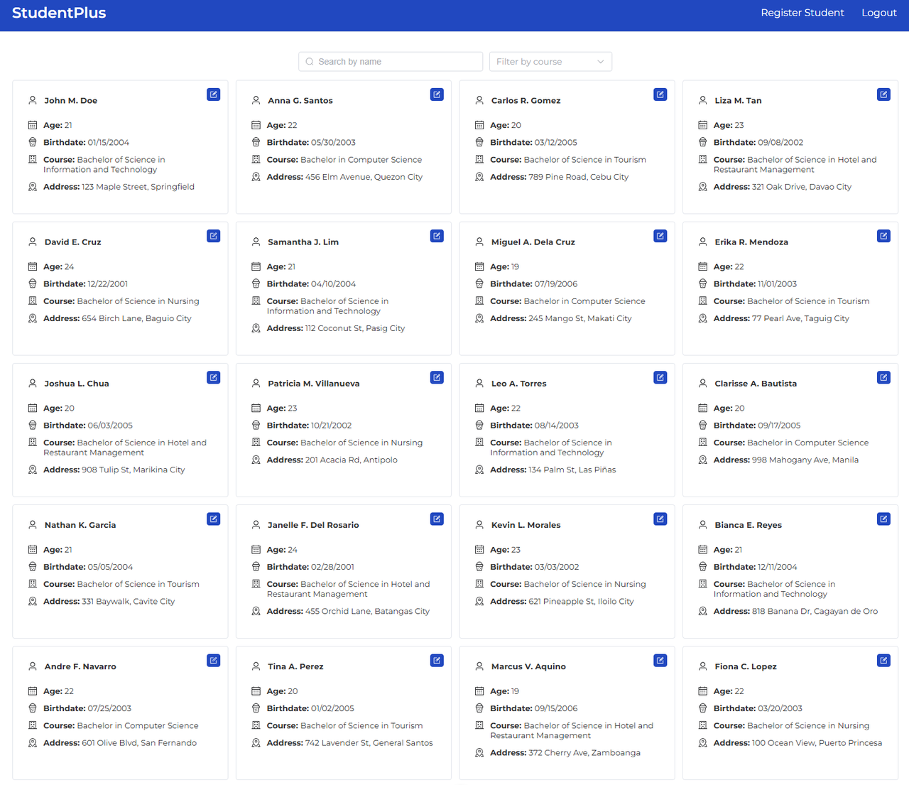
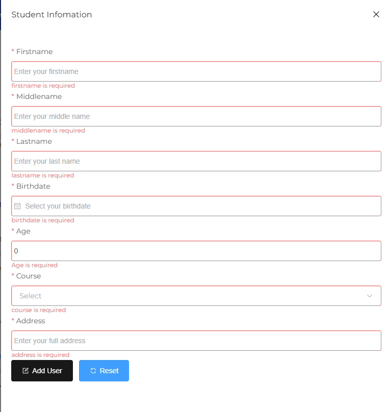
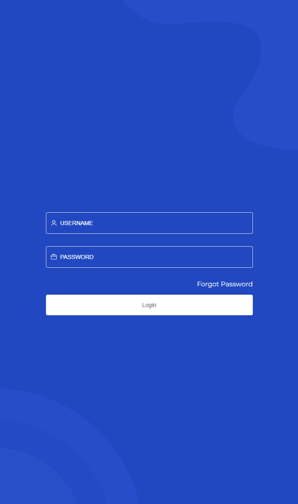

# StudentPlus

StudentPlus is a simple student registration form application designed to store and manage student registration data.



## Installation and Setup
Follow the steps below to set up the project:

Clone Repository
```
git clone https://github.com/FCL00/student-registration.git
```

Run `npm run install`
```
npm run install
```
Then run the server
```
npm run dev
```
Type-Check, Compile and Minify for Production
```
npm run build
```


## Features
- Add new student records
- Update existing student details
- Delete students from the record
- View all registered students
- Input validation and error handling
- Authentication / Forgot Password

## Functional Requirement
| Feature                          | Description                                                |
| -------------------------------- | ---------------------------------------------------------- |
| **Data (Variables)**             | Store student form input values                            |
| **Binding**                      | Use `v-model` to bind input fields                         |
| **Conditionals**                 | Show/hide messages or fields (e.g., success message)       |
| **Iterations**                   | Loop through course options or display records             |
| **Responsive**                   | Mobile-first layout using CSS/Flex/Grid                    |
| **Method (Validation & Submit)** | Validate form input and submit data                        |
| **Computed**                     | Auto-calculate age from birth date                         |
| **Watch Properties**             | Monitor changes in birth date to update age                |
| **Add Student Records (Table)**  | Display registered students in a table                     |
| **Components**                   | Use child components (e.g., StudentForm, StudentTable)     |
| **Props**                        | Pass data between parent-child components                  |
| **Routing**                      | Use Vue Router for navigation between login/register pages |
| **Emit**                         | Emit custom events from child to parent                    |
| **Local Storage (Pinia)**        | Store student records in local storage using Pinia         |
| **Documentation**                | Full technical documentation of all features               |


## Project Structure
```
student-registration/
│
├── public/                # Static files
├── src/
│   ├── assets/            # Images, fonts, styles
│   ├── components/        # Vue components
│   ├── composable/        # Api
|   ├── constants/         # Constants variables
│   ├── router/            # Vue Router setup
│   ├── store/             # Pinia Store
│   ├── types/             # types
│   ├── utils/             # utility functions
│   ├── views/             # View pages (Home.vue, Students.vue, etc.)
│   └── App.vue            # Main App component
│   └── main.ts            # App entry point
├── package.json
└── README.md     
```

## Routing Structure
| Path               | Component                | Description             |
| ------------------ | ------------------------ | ----------------------- |
| `/login`           | `LoginPage.vue`          | User login page         |
| `/forgot-password` | `ForgotPasswordPage.vue` | Reset Password Page     |
| `/dashboard`       | `Dashboard.vue`          | Display of all students |


## Demo

### Add student record

### Update student record

### View all registered students

### Input validation and error handling

### Authentication / Forgot Password

